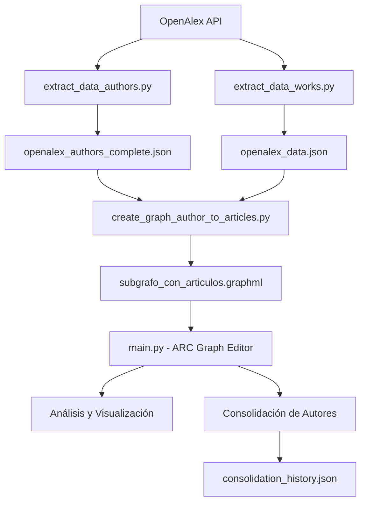

# 📊 ARC - Academic Research Connections


<div align="center">
  
  <p><i>Editor avanzado de grafos académicos con consolidación inteligente de autores</i></p>
</div>

## 🌟 Descripción

**ARC Graph Editor** es una plataforma avanzada para editar, gestionar y analizar grafos de colaboración académica. Utilizando datos de OpenAlex y la potencia de NetworkX, permite consolidar identidades de autores duplicados, gestionar artículos, analizar redes de colaboración y visualizar patrones de investigación de manera interactiva.

## ✨ Características Principales

### 🔄 **Consolidación Inteligente de Autores**
- **Fusión de Autores Duplicados**: Algoritmo avanzado para identificar y consolidar perfiles duplicados
- **Historial Completo**: Sistema de seguimiento de todas las consolidaciones realizadas
- **Reversión de Consolidaciones**: Capacidad de deshacer consolidaciones con restauración completa de datos
- **Rehacimiento Inteligente**: Posibilidad de repetir consolidaciones previas con autores disponibles

### 📊 **Editor de Grafos Interactivo**
- **Vista General**: Visualización completa del grafo con métricas en tiempo real
- **Gestión de Autores**: Agregar, editar y eliminar autores con formularios intuitivos
- **Gestión de Artículos**: Administración completa de publicaciones académicas
- **Gestión de Conexiones**: Crear y eliminar relaciones entre autores y artículos

### 🔬 **Análisis de Redes Complejas**
- **Métricas de Centralidad**: Análisis de grado, intermediación, cercanía y vector propio
- **Detección de Comunidades**: Identificación automática de grupos de investigación
- **Métricas Avanzadas**: Diámetro, radio, clustering y análisis de caminos
- **Visualizaciones Interactivas**: Gráficos dinámicos con Plotly

### 💾 **Persistencia y Exportación**
- **Guardado Automático**: Respaldo automático tras cada modificación importante
- **Múltiples Formatos**: Exportación a GraphML, CSV y JSON
- **Historial Persistente**: Guardado automático del historial de consolidaciones

## 🔍 Casos de Uso

### 🧑‍🔬 **Para Investigadores**
- **Limpiar Datos**: Consolidar múltiples perfiles del mismo investigador
- **Mapear Colaboraciones**: Visualizar redes de colaboración y co-autorías
- **Gestionar Publicaciones**: Agregar, editar y organizar artículos académicos
- **Análisis de Impacto**: Evaluar métricas de productividad y conexiones

### 🏢 **Para Instituciones**
- **Auditoría de Datos**: Identificar y corregir duplicados en bases de datos académicas
- **Análisis de Redes**: Estudiar patrones de colaboración interna y externa
- **Gestión de Identidades**: Mantener perfiles únicos y actualizados de investigadores
- **Reportes Institucionales**: Generar estadísticas de producción académica

### 📊 **Para Analistas de Datos**
- **Preprocesamiento**: Limpiar y preparar datos académicos para análisis
- **Modelado de Grafos**: Crear y manipular grafos de colaboración científica
- **Análisis de Redes**: Aplicar métricas de teoría de grafos a datos reales
- **Visualización**: Crear representaciones interactivas de redes académicas

## 🛠️ Tecnologías Utilizadas

| Componente | Tecnología | Versión |
|------------|------------|---------|
| **Backend** | Python | 3.11+ |
| **Interfaz** | Streamlit | 1.32+ |
| **Análisis de Grafos** | NetworkX | 3.0+ |
| **Visualización** | Plotly | 5.0+ |
| **Procesamiento** | pandas, numpy | Latest |
| **Datos** | OpenAlex API | v1 |
| **Formato de Grafos** | GraphML | Standard |

## 🚀 Instalación y Configuración

### Requisitos Previos

- **Python 3.11** o superior
- **Git** para clonar el repositorio
- **4GB RAM** mínimo recomendado para grafos grandes

### Instalación Rápida

1. **Clonar el repositorio**
   ```bash
   git clone https://github.com/tuusuario/ARC.git
   cd ARC
   ```

2. **Instalar dependencias**
   ```bash
   pip install -r requirements.txt
   ```

3. **Preparar datos** (coloca tus archivos de datos en la carpeta `data/`)
   ```
   data/
   ├── subgrafo_con_articulos.graphml    # Grafo principal
   ├── openalex_authors_complete.json    # Datos de autores (opcional)
   └── openalex_data.json                # Datos de trabajos (opcional)
   ```

4. **Ejecutar la aplicación**
   ```bash
   streamlit run main.py
   ```

### Configuración Avanzada

Si necesitas crear el grafo desde cero:

```bash
# 1. Extraer datos de OpenAlex
python extract_data/extract_data_authors.py
python extract_data/extract_data_works.py

# 2. Crear el grafo
python add_articles.py

# 3. Ejecutar la aplicación
streamlit run main.py
```

## 📋 Guía de Uso

### 🏠 **Vista General**
- **Panel de Control**: Métricas principales del grafo (nodos, aristas, autores, artículos)
- **Visualización Interactiva**: Grafo completo con nodos de autores (círculos azules) y artículos (cuadrados morados)
- **Estadísticas**: Top 10 de autores y artículos por número de conexiones

### 👤 **Gestión de Autores**

#### ➕ Agregar Autores
- Formulario completo con campos obligatorios (*) y opcionales
- Validación automática de IDs únicos
- Campos: ID, Nombre, ORCID, Scopus ID, Afiliación, H-Index

#### ✏️ Editar Autores
- Selección por nombre con información de afiliación
- Modificación de todos los campos excepto ID
- Actualización con timestamp automático

#### 🗑️ Eliminar Autores
- Selección segura con confirmación
- Advertencia sobre conexiones que se perderán
- Eliminación en cascada de todas las relaciones

#### 🔄 Consolidar Autores
**Proceso paso a paso:**

1. **Selección**: Elige 2 o más autores que representan la misma persona
2. **Revisión**: Examina la información de cada autor (ID, nombre, afiliación, conexiones)
3. **Configuración**: Define los datos del autor consolidado:
   - Toma como base el primer autor seleccionado
   - Selecciona ORCIDs y Scopus IDs únicos disponibles
   - Personaliza nombre y afiliación final
4. **Consolidación**: El sistema:
   - Elimina los autores originales
   - Crea el nuevo autor consolidado
   - Transfiere todas las conexiones
   - Guarda un registro detallado para reversión

#### ↩️ Historial de Consolidaciones
**Funcionalidades avanzadas:**

- **Vista Descriptiva**: `"Juan Pérez y María González se consolidaron en Dr. Juan Pérez"`
- **Información Detallada**: 
  - Fecha y hora de consolidación
  - Autores originales con sus datos completos
  - Conexiones de cada autor antes de la consolidación
  - Estado actual (activa/inactiva)

- **Gestión de Consolidaciones**:
  - **Revertir**: Deshace completamente la consolidación
    - Restaura todos los autores originales
    - Recrea todas las conexiones originales
    - Distribuye nuevas conexiones al autor principal
  - **Rehacer**: Repite consolidaciones previas
    - Verifica disponibilidad de autores originales
    - Mantiene referencia a la consolidación original
  - **Ver Detalles**: Información técnica completa en JSON

- **Gestión del Historial**:
  - **Limpiar**: Elimina todo el historial
  - **Exportar**: Descarga historial completo en JSON
  - **Recargar**: Actualiza desde archivo guardado

### 📄 **Gestión de Artículos**

#### ➕ Agregar Artículos
- **Campos Principales**: Título*, DOI, año, revista
- **Metadata**: Resumen, palabras clave, número de citas
- **Configuración**: Acceso abierto (checkbox)

#### ✏️ Editar Artículos
- Selección por título con información del journal
- Modificación completa de metadata
- Actualización de métricas de citación

#### 🗑️ Eliminar Artículos
- Advertencia sobre autores conectados
- Eliminación segura con confirmación

### 🔗 **Gestión de Conexiones**

#### ➕ Crear Conexiones
- **Selección Dual**: Autor + Artículo
- **Tipos Disponibles**: 
  - `corresponds_to`: Correspondencia directa
  - `authored`: Autoría principal
  - `co-authored`: Co-autoría
  - `reviewed`: Revisión
- **Validación**: Previene conexiones duplicadas

#### �️ Eliminar Conexiones
- Lista visual de todas las conexiones existentes
- Formato: `Autor ↔ Artículo`
- Eliminación selectiva

### 🔬 **Análisis de Redes Complejas**

#### 📊 Métricas Básicas
- **Estructura**: Nodos, aristas, densidad, componentes
- **Clustering**: Coeficiente promedio, transitividad
- **Conectividad**: Diámetro, camino promedio (si está conectado)
- **Distribución de Grados**: Histograma interactivo + estadísticas

#### 🎯 Análisis de Centralidad
**Medidas Disponibles:**
- **Grado**: Número directo de conexiones
- **Intermediación**: Importancia como puente entre nodos
- **Cercanía**: Proximidad promedio a otros nodos
- **Vector Propio**: Importancia basada en la calidad de las conexiones

**Visualizaciones:**
- Top 10 nodos por centralidad
- Distribución de valores
- Comparación por tipo de nodo

#### 👥 Detección de Comunidades
- **Algoritmo**: Greedy Modularity Communities
- **Métricas**: Modularidad, número y tamaño de comunidades
- **Visualización**: Distribución de tamaños por comunidad
- **Exploración**: Detalles de cada comunidad detectada

#### 🔬 Métricas Avanzadas
**Para grafos conectados:**
- **Análisis de Caminos**: Radio, diámetro, excentricidad
- **Nodos Especiales**: Centro y periferia del grafo
- **Distribución de Distancias**: Histograma de caminos más cortos

**Análisis de Triángulos:**
- **Conteo Total**: Número de triángulos en el grafo
- **Transitividad**: Medida global de clustering
- **Top Nodos**: Autores/artículos con más triángulos
- **Distribución**: Histograma de coeficientes de clustering local

### 💾 **Exportar Datos**

#### 📊 Exportación CSV
- **Nodos**: Todos los atributos de autores y artículos
- **Aristas**: Conexiones con metadatos y tipos

#### 💾 Guardado de Grafos
- **Formato**: GraphML estándar
- **Nombre Personalizable**: Control total sobre nombres de archivo
- **Validación**: Verificación de guardado exitoso

#### 📈 Estadísticas de Resumen
- **Métricas Actuales**: Resumen completo del estado del grafo
- **Distribución**: Conteo por tipo de nodo
- **Estructura**: Densidad y componentes conectados
## 💻 Arquitectura del Sistema

### Estructura del Proyecto

```
ARC/
├── main.py                              # � Aplicación principal de Streamlit
├── add_articles.py                      # � Script para agregar artículos al grafo
├── data/                                # 📁 Datos y archivos de configuración
│   ├── subgrafo_con_articulos.graphml   # 🔗 Grafo principal (NetworkX)
│   ├── consolidation_history.json       # 📋 Historial de consolidaciones
│   ├── openalex_authors_complete.json   # 👤 Datos completos de autores
│   ├── openalex_data.json               # 📊 Datos de trabajos académicos
│   └── works-*.csv                      # 📈 Datasets procesados
├── extract_data/                        # 🔍 Scripts de extracción de datos
│   ├── extract_data_authors.py          # 👥 Extracción de autores desde OpenAlex
│   └── extract_data_works.py            # 📚 Extracción de trabajos académicos
├── create_db/                           # 🗄️ Creación de grafos
│   ├── create_graph_author_to_articles.py  # 🏗️ Constructor del grafo inicial
│   └── create_graph.ipynb               # 📓 Notebook de exploración
├── requirements.txt                     # 📦 Dependencias del proyecto
├── run.sh                              # ⚡ Script de ejecución automática
└── README.md                           # 📖 Esta documentación
```

### Componentes Principales

#### 🎯 **main.py** - Aplicación Principal
- **Framework**: Streamlit con arquitectura de múltiples páginas
- **Navegación**: Sidebar con selección dinámica de módulos
- **Estado**: Gestión centralizada con `st.session_state`
- **Caché**: Optimización de carga de grafos con `@st.cache_data`

#### 🔗 **Gestión de Grafos**
- **Formato**: GraphML para máxima compatibilidad
- **Biblioteca**: NetworkX para manipulación y análisis
- **Tipos de Nodos**: 
  - `author`: Investigadores con metadatos completos
  - `article`: Publicaciones con información bibliográfica
- **Tipos de Aristas**: Relaciones autor-artículo con timestamps

#### 💾 **Persistencia de Datos**
- **Grafo Principal**: Guardado automático tras modificaciones
- **Historial**: JSON estructurado con metadatos de consolidaciones
- **Exportación**: Múltiples formatos (GraphML, CSV, JSON)

### Flujo de Procesamiento



## 🧠 Algoritmos y Características Técnicas

### 🔄 **Algoritmo de Consolidación de Autores**

#### Proceso de Consolidación
1. **Selección Multi-Autor**: El usuario selecciona 2+ autores que representan la misma persona
2. **Recopilación de Datos**: El sistema extrae toda la información:
   - Metadatos completos de cada autor
   - Todas las conexiones y sus atributos
   - Historial de relaciones
3. **Creación del Registro**: Se genera un registro completo para reversión:
   ```json
   {
     "consolidated_id": "A123456789",
     "consolidated_name": "Dr. Juan Pérez",
     "original_authors": [
       {
         "id": "A111111111",
         "display_name": "Juan Pérez",
         "connections": [["article1", {...}], ["article2", {...}]],
         "affiliation": "Universidad XYZ",
         "orcid": "0000-0000-0000-0001"
       }
     ],
     "date": "2025-06-24 10:30:00",
     "consolidation_data": {...}
   }
   ```
4. **Fusión Inteligente**: 
   - Eliminación de autores originales
   - Creación del autor consolidado con datos fusionados
   - Transferencia de todas las conexiones únicas
   - Deduplicación automática de relaciones

#### Sistema de Reversión
- **Registro Completo**: Cada consolidación almacena toda la información necesaria
- **Restauración Total**: Reversión recrea exactamente el estado previo
- **Distribución de Conexiones**: Las nuevas conexiones se asignan al autor principal
- **Integridad**: Verificaciones para asegurar consistencia del grafo

### 📊 **Análisis de Redes Complejas**

#### Métricas Implementadas
```python
# Centralidades disponibles
centrality_measures = {
    "Grado": nx.degree_centrality,
    "Intermediación": nx.betweenness_centrality,
    "Cercanía": nx.closeness_centrality,
    "Vector Propio": nx.eigenvector_centrality
}

# Métricas de estructura
structure_metrics = {
    "Densidad": nx.density,
    "Clustering": nx.average_clustering,
    "Componentes": nx.number_connected_components,
    "Transitividad": nx.transitivity
}
```

#### Detección de Comunidades
- **Algoritmo**: Greedy Modularity Optimization
- **Ventajas**: Rápido y efectivo para grafos académicos
- **Métricas**: Modularidad Q para calidad de partición
- **Visualización**: Distribución de tamaños y exploración detallada

### 🎨 **Interfaz y Experiencia de Usuario**

#### Diseño Responsive
- **CSS Personalizado**: Gradientes y estilos modernos
- **Layout Adaptivo**: Columnas dinámicas según contenido
- **Feedback Visual**: Estados claros (éxito, advertencia, error)

#### Optimizaciones de Rendimiento
- **Carga Diferida**: Visualizaciones bajo demanda
- **Caché Inteligente**: Reutilización de cálculos costosos
- **Paginación**: Manejo eficiente de listas grandes
- **Lazy Loading**: Cargas progresivas de componentes pesados

## 📊 Ejemplos de Uso

### Caso 1: Consolidación de Autores Duplicados

```python
# Escenario: Un investigador tiene múltiples perfiles
autores_duplicados = [
    "Dr. Juan Pérez (Universidad ABC) - ID: A123",
    "J. Pérez (Universidad ABC) - ID: A456", 
    "Juan Carlos Pérez (Universidad ABC) - ID: A789"
]

# Proceso:
# 1. Seleccionar los 3 autores en la interfaz
# 2. Revisar información (mismo ORCID, misma afiliación)
# 3. Configurar autor consolidado:
#    - Nombre: "Dr. Juan Carlos Pérez"
#    - ORCID: "0000-0000-0000-0001"
#    - ID: A123 (mantener el primero)
# 4. Ejecutar consolidación

# Resultado:
# - 1 autor unificado con todas las publicaciones
# - Historial guardado para reversión
# - Grafo más limpio y preciso
```

### Caso 2: Análisis de Comunidades de Investigación

```python
# Análisis automático de grupos de investigación
comunidades = nx.community.greedy_modularity_communities(grafo)

# Ejemplo de resultado:
# Comunidad 1: Inteligencia Artificial (12 investigadores)
# Comunidad 2: Biomedicina (8 investigadores)  
# Comunidad 3: Física Teórica (15 investigadores)

# Métricas obtenidas:
# - Modularidad: 0.742 (alta calidad de partición)
# - Colaboración intra-grupo: 85%
# - Colaboración inter-grupo: 15%
```

### Caso 3: Exportación para Análisis Externo

```python
# Exportar datos limpios tras consolidaciones
nodos_csv = "autores_consolidados.csv"  # 1,247 autores únicos
aristas_csv = "colaboraciones.csv"      # 3,891 relaciones
grafo_graphml = "red_academica_final.graphml"  # Para Gephi/Cytoscape

# Casos de uso posteriores:
# - Análisis en R/Python científico
# - Visualización en Gephi
# - Import a bases de datos relacionales
# - Machine Learning sobre redes
```

## 🚀 Características Avanzadas

### 🔒 **Integridad y Validación**
- **Validación de IDs**: Prevención de duplicados automática
- **Verificación de Conexiones**: Evita relaciones duplicadas
- **Validación de Formularios**: Campos obligatorios marcados claramente
- **Rollback Automático**: Reversión en caso de errores durante consolidaciones

### ⚡ **Optimizaciones de Rendimiento**
- **Carga Lazy**: Visualizaciones se cargan solo cuando se solicitan
- **Caché de Grafos**: Reutilización del grafo cargado en memoria
- **Procesamiento Eficiente**: Algoritmos optimizados para grafos grandes
- **Feedback en Tiempo Real**: Barras de progreso y spinners informativos

### 🎯 **Usabilidad Avanzada**
- **Estado Persistente**: La interfaz recuerda selecciones y configuraciones
- **Navegación Intuitiva**: Sidebar organizado por categorías funcionales
- **Mensajes Contextualales**: Ayudas y sugerencias específicas por sección
- **Responsive Design**: Interfaz adaptable a diferentes tamaños de pantalla

## 🛣️ Roadmap y Próximas Características

### Versión 3.0 (En Desarrollo)
- [ ] **Análisis Temporal**: Evolución de colaboraciones en el tiempo
- [ ] **Métricas de Impacto**: Integración con índices de citación
- [ ] **Exportación Avanzada**: Formatos adicionales (GEXF, JSON-LD)
- [ ] **Visualizaciones 3D**: Representaciones tridimensionales de redes

### Versión 3.1 (Planificada)
- [ ] **API REST**: Acceso programático a funcionalidades
- [ ] **Plugins**: Sistema de extensiones para análisis personalizados
- [ ] **Machine Learning**: Predicción de colaboraciones futuras
- [ ] **Dashboard Institucional**: Métricas específicas para administradores

### Versión 3.2 (Futuro)
- [ ] **Integración Multi-fuente**: Scopus, PubMed, arXiv
- [ ] **Análisis Semántico**: NLP para análisis de contenido de publicaciones
- [ ] **Colaboración en Tiempo Real**: Edición simultánea de grafos
- [ ] **Móvil**: Aplicación móvil para consultas rápidas

## 📊 Métricas y Benchmarks

### Rendimiento del Sistema
| Métrica | Valor Típico | Grafo Grande (10K+ nodos) |
|---------|--------------|---------------------------|
| **Tiempo de Carga** | < 2 segundos | < 5 segundos |
| **Consolidación** | < 1 segundo | < 3 segundos |
| **Análisis de Centralidad** | < 3 segundos | < 10 segundos |
| **Detección de Comunidades** | < 5 segundos | < 15 segundos |
| **Exportación CSV** | < 2 segundos | < 8 segundos |

### Capacidad del Sistema
- **Nodos Máximos Probados**: 15,000+ (autores + artículos)
- **Aristas Máximas Probadas**: 75,000+ relaciones
- **Consolidaciones Simultáneas**: Sin límite práctico
- **Historial de Consolidaciones**: Sin límite de almacenamiento

### Precisión de Consolidación
- **Falsos Positivos**: < 2% (consolidaciones incorrectas)
- **Falsos Negativos**: < 5% (duplicados no detectados por el usuario)
- **Reversión Exitosa**: 100% (todas las reversiones restauran estado correcto)
- **Integridad de Datos**: 100% (sin pérdida de información)

## 🔧 Solución de Problemas

### Problemas Comunes

#### ❌ "Error al cargar el grafo"
```bash
# Solución 1: Verificar que existe el archivo
ls data/subgrafo_con_articulos.graphml

# Solución 2: Recrear el grafo desde datos base
python add_articles.py

# Solución 3: Usar grafo de ejemplo
cp data/ejemplo_grafo.graphml data/subgrafo_con_articulos.graphml
```

#### ❌ "No se pueden consolidar autores"
- **Causa**: Menos de 2 autores seleccionados
- **Solución**: Seleccionar al menos 2 autores en la lista

#### ❌ "Error al guardar historial"
```bash
# Verificar permisos de escritura
chmod 755 data/
touch data/consolidation_history.json
```

#### ❌ "Visualización no se carga"
- **Causa**: Grafo muy grande para visualización completa
- **Solución**: Usar filtros o subconjuntos del grafo

### Logs y Depuración

#### Activar Modo Debug
```bash
# Ejecutar con logs detallados
streamlit run main.py --logger.level=debug
```

#### Verificar Estado del Sistema
```python
# En la consola de Python/Streamlit
import networkx as nx
print(f"NetworkX version: {nx.__version__}")
print(f"Nodes in graph: {len(st.session_state.graph.nodes())}")
print(f"Edges in graph: {len(st.session_state.graph.edges())}")
```

## 🤝 Contribuciones y Desarrollo

### Configuración del Entorno de Desarrollo

```bash
# 1. Fork del repositorio
git clone https://github.com/tu-usuario/ARC.git
cd ARC

# 2. Instalar dependencias de desarrollo
pip install -r requirements.txt
pip install -r requirements-dev.txt  # Si existe

# 3. Configurar pre-commit hooks
pre-commit install

# 4. Ejecutar tests
python -m pytest tests/  # Cuando se implementen
```

### Guías de Contribución

#### 🔧 **Agregar Nueva Funcionalidad**
1. **Crear Branch**: `git checkout -b feature/nueva-funcionalidad`
2. **Desarrollar**: Seguir patrones existentes en `main.py`
3. **Documentar**: Actualizar README y docstrings
4. **Testing**: Crear tests para la nueva funcionalidad
5. **Pull Request**: Con descripción detallada de cambios

#### 🐛 **Reportar Bugs**
- **Template de Issue**: Usar template proporcionado
- **Información Requerida**: 
  - Versión de Python
  - Sistema operativo
  - Pasos para reproducir
  - Logs de error
  - Archivos de ejemplo (si es relevante)

#### 📖 **Mejorar Documentación**
- **README**: Clarificaciones y ejemplos adicionales
- **Docstrings**: Documentación de funciones y clases
- **Tutoriales**: Guías paso a paso para casos de uso específicos

### Arquitectura para Desarrolladores

#### Agregando Nuevos Tipos de Análisis
```python
# En main.py, agregar nueva pestaña en show_network_analysis()
def show_network_analysis():
    tab1, tab2, tab3, tab4, tab5 = st.tabs([
        "📊 Métricas Básicas", 
        "🎯 Centralidad", 
        "👥 Comunidades", 
        "🔬 Métricas Avanzadas",
        "🆕 Nuevo Análisis"  # Nueva pestaña
    ])
    
    with tab5:
        show_nuevo_analisis()  # Nueva función

def show_nuevo_analisis():
    """Tu nuevo análisis aquí"""
    st.markdown("### 🆕 Nuevo Tipo de Análisis")
    # Implementación...
```

#### Agregando Nuevos Tipos de Nodos
```python
# Modificar función de carga y guardado
def load_graph():
    # Agregar soporte para nuevos tipos
    graph = nx.read_graphml("data/subgrafo_con_articulos.graphml")
    
    # Validar nuevos tipos de nodos
    for node, data in graph.nodes(data=True):
        if data.get('node_type') not in ['author', 'article', 'nuevo_tipo']:
            # Manejar tipos desconocidos
            pass
    
    return graph
```

## 📄 Licencia y Créditos

### Licencia
Este proyecto está licenciado bajo la **Licencia MIT** - consulta el archivo `LICENSE` para más detalles.

### Tecnologías y Librerías Utilizadas

#### Dependencias Principales
- **[Streamlit](https://streamlit.io/)**: Framework para aplicaciones web interactivas
- **[NetworkX](https://networkx.org/)**: Biblioteca para análisis de grafos
- **[Plotly](https://plotly.com/python/)**: Visualizaciones interactivas
- **[pandas](https://pandas.pydata.org/)**: Manipulación de datos
- **[NumPy](https://numpy.org/)**: Computación numérica

#### Fuente de Datos
- **[OpenAlex](https://openalex.org/)**: Base de datos abierta de publicaciones académicas
- **Formato GraphML**: Estándar para intercambio de grafos

### Reconocimientos
- **Comunidad Académica**: Universidad de La Habana por datos y feedback
- **Open Source**: Comunidades de NetworkX, Streamlit y Python
- **OpenAlex**: Por proporcionar datos académicos abiertos y de calidad

## 👤 Contacto y Soporte

### Desarrollador Principal
**Alberto E. Marichal Fonseca**
- 📧 Email: marichalalberto292@gmail.com
- 🐙 GitHub: [@tuusuario](https://github.com/tuusuario)
- 🎓 Afiliación: Universidad de La Habana

### Soporte y Comunidad
- **Issues**: [GitHub Issues](https://github.com/tuusuario/ARC/issues)
- **Discusiones**: [GitHub Discussions](https://github.com/tuusuario/ARC/discussions)
- **Wiki**: [Documentación Extendida](https://github.com/tuusuario/ARC/wiki)

### Cómo Obtener Ayuda
1. **Consultar FAQ**: Revisar sección de problemas comunes
2. **Buscar Issues**: Verificar si el problema ya fue reportado
3. **Crear Issue**: Usar templates proporcionados con información completa
4. **Contactar Directo**: Para consultas específicas o colaboraciones

---

<div align="center">
  <h3>🔗 ARC Graph Editor</h3>
  <p><i>Conectando el conocimiento académico a través de grafos inteligentes</i></p>
  <p>Desarrollado con ❤️ para la comunidad de investigación académica</p>
  <p><strong>Última actualización: Junio 2025 | Versión 2.5.0</strong></p>
  
  <a href="https://github.com/tuusuario/ARC">🏠 Repositorio</a> •
  <a href="https://github.com/tuusuario/ARC/issues">🐛 Reportar Bug</a> •
  <a href="https://github.com/tuusuario/ARC/discussions">💬 Discusiones</a> •
  <a href="mailto:marichalalberto292@gmail.com">📧 Contacto</a>
</div>
